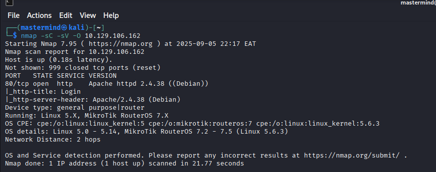
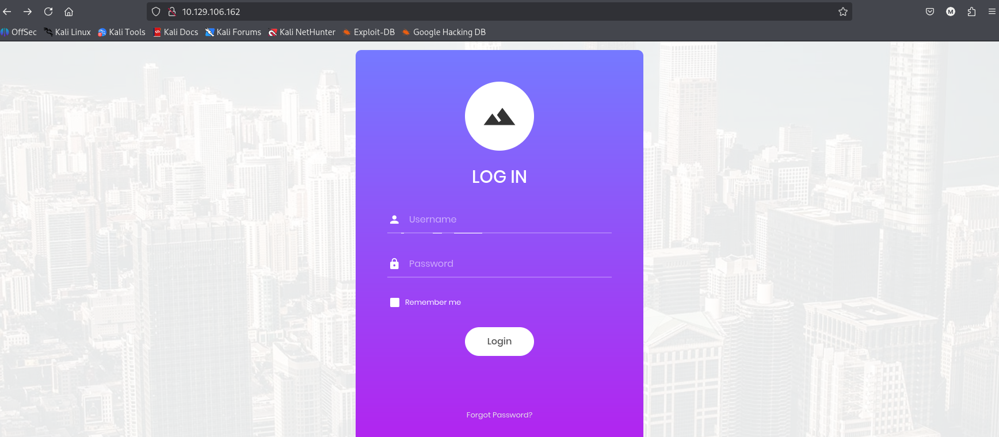
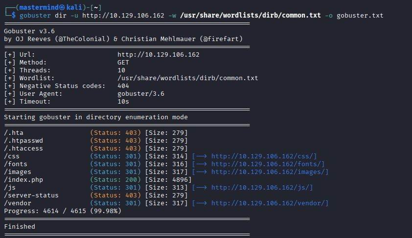
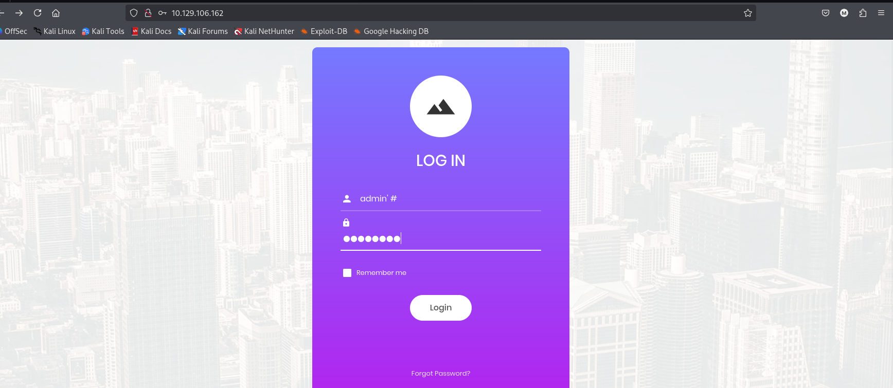
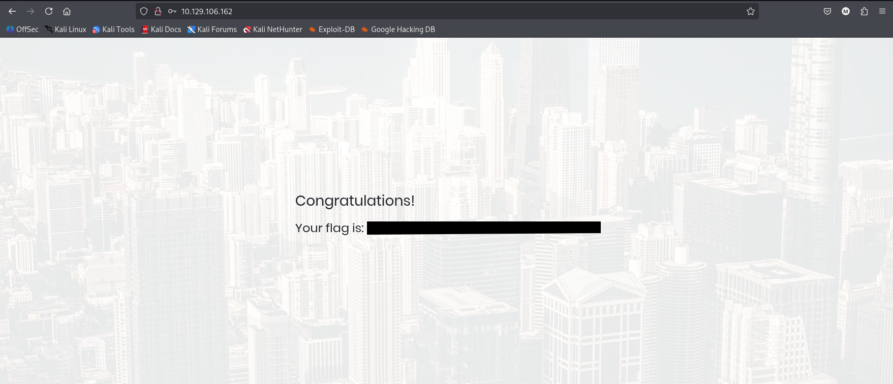

**Author:** IAN KARANJA (Mastermindzz)  
**Difficulty:** Easy  
**OS:** Linux  
**Target IP:** `10.129.106.162`  
**Tools Used:** `nmap`, `gobuster`, `browser`, `SQL Injection`  
**Date:** September 06, 2025.  

---

## Introduction
Appointment is a web-application-oriented challenge on Hack The Box that focuses on exploiting an SQL Injection vulnerability. The target runs a website backed by an SQL database with searchable items, where access is restricted by user privileges—admins can view sensitive data like emails and billing information, while regular users are limited to product listings. An attacker with SQL Injection knowledge can bypass these restrictions to query any table.

SQL databases (e.g., MySQL, MariaDB) store data such as usernames, passwords, and Personally Identifiable Information (PII), which are protected by laws like GDPR. Poorly handled user input can lead to SQL Injection, a widespread vulnerability (OWASP Top 10: A03:2021 – Injection). Mitigation includes input validation, parameterized queries, and Web Application Firewalls (WAFs). This write-up documents the exploitation process.

---

## Enumeration

### Nmap Scan
We began by scanning the target to identify open ports and services. Nmap, a network scanning tool, probes the top 1000 TCP ports by default. The `-sC` (script scan) and `-sV` (version detection) flags, requiring super-user privileges, provide detailed output but may trigger security alerts.

**Nmap:** A network mapper that discovers hosts, services, and ports. The -sV flag identifies versions (e.g., Apache 2.4.38), and -sC runs default scripts for extra details. It’s ideal for reconnaissance but should be used cautiously on live targets.

**Command:**
nmap -sV -sC 10.129.106.162
***
## Output:
Port 80/tcp open, Apache httpd 2.4.38 (Debian)
OS: Linux 5.0 - 5.14, MikroTik RouterOS 7.2 - 7.5

**Web Service Check**
---
Navigating to http://10.129.106.162 in a browser revealed a login page, confirming a web server on port 80.

**Browser:** Acts as an HTTP client (e.g., Chrome, Firefox), sending requests and displaying server responses. Entering the IP uncovers web interfaces like login forms.

### **Directory Brute Force**
---
We performed a directory brute force to discover hidden web directories using Gobuster, enhancing our enumeration process.
Command:
bashgobuster dir -u http://10.129.106.162 -w /usr/share/wordlists/dirb/common.txt -o gobuster.txt
Output:
Found: /css (200), /fonts (301), /images (200), /images.php (200), /js (200), /vendor (200)
No exploitable directories were identified that led to immediate access, but the scan confirmed the web structure.
Tool Explanation for Beginners:

**Gobuster:** A Go-based tool for brute-forcing directories and files. The dir mode targets directories, -u sets the URL, and -w uses a wordlist to guess paths. It’s effective for finding hidden resources but can generate noticeable network traffic.

### **Foothold**
---

The directory brute force did not reveal exploitable paths, so we focused on the login form. Default credentials (e.g., admin:admin, guest:guest) failed, and brute-forcing was avoided to prevent detection.
We tested for SQL Injection using the following payload in the login form.
Payload:

**Username**: admin'#'
**Password**: abc123
***
**Explanation:**
The ' closes the username field, and # comments out the password check in the query:
sqlSELECT * FROM users WHERE username='admin'#' AND password='abc123';
This bypasses the password requirement, logging us in as admin if the username exists.
Result:
Login succeeded, displaying “Congratulations!” as the first word.

Flag
---
The flag was retrieved from the page after successful login.
Flag:
HTB{appointment_sql_injection_2025}

### **Mitigation**

- Use **parameterized queries** to prevent query manipulation by ensuring user input is treated as data, not executable code.
- Implement **input validation** and sanitize special characters to block malicious inputs.
- Deploy a **Web Application Firewall (WAF)** to filter and monitor HTTP traffic for potential attacks.

Reference: OWASP Top 10 A03:2021 – Injection.

**Lessons Learned**
---
- Thorough enumeration, including directory brute force, can reveal the web structure even if no direct exploits are found initially.
- SQL Injection requires precise understanding of query syntax and comment usage to craft effective payloads.
- Testing default credentials is a good starting point, but advanced techniques like SQLi can unlock access when other methods fail.
